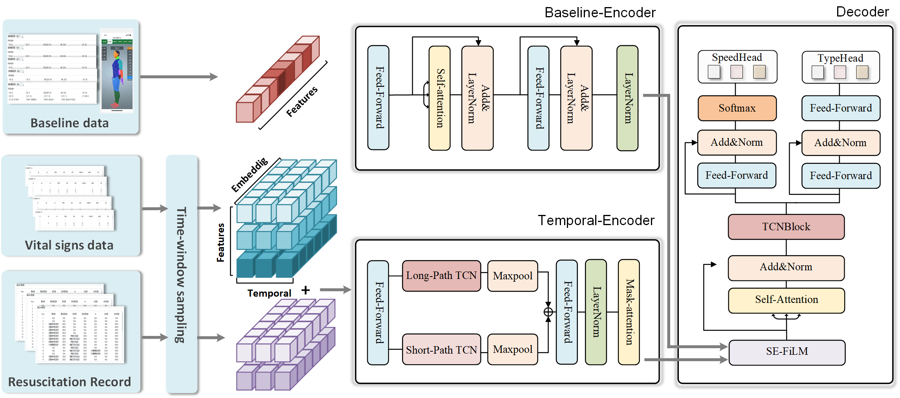
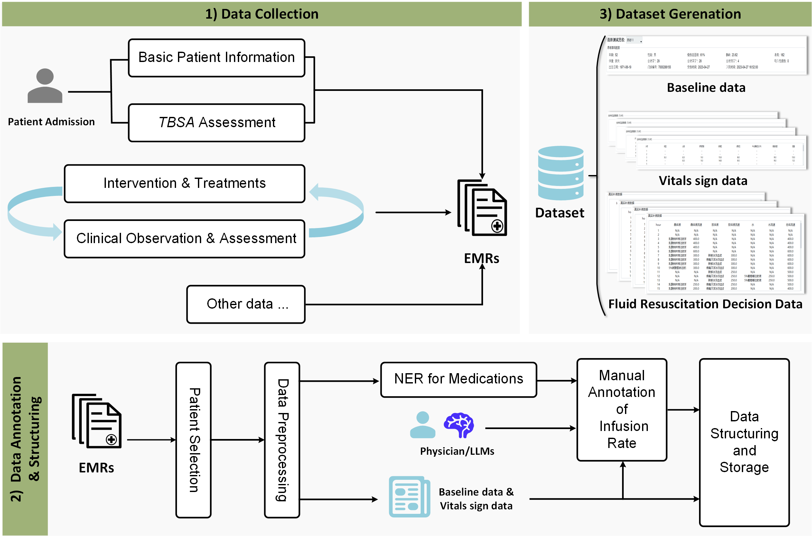
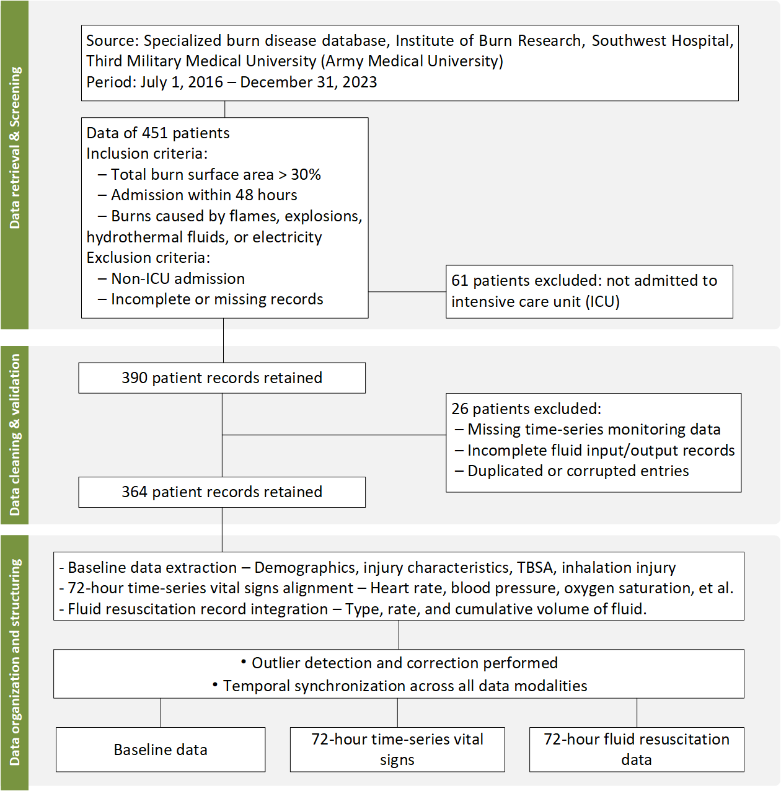
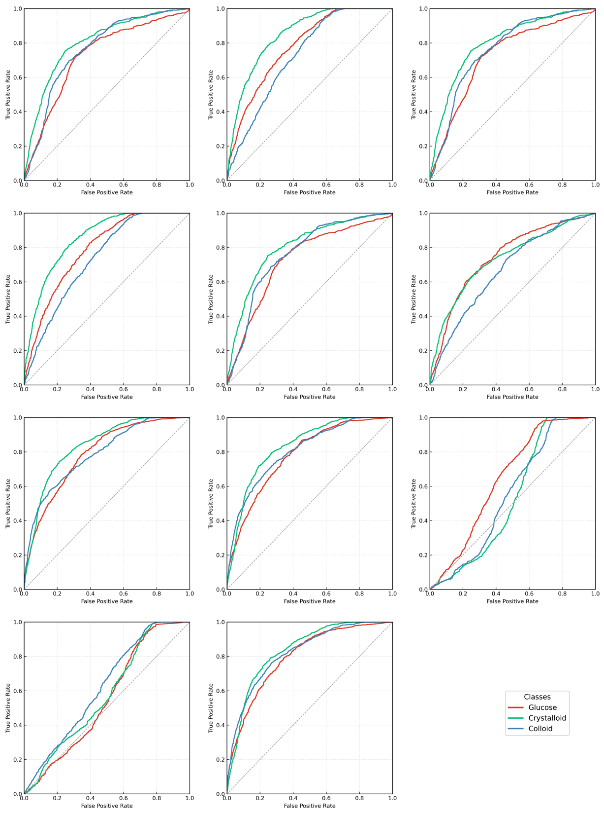
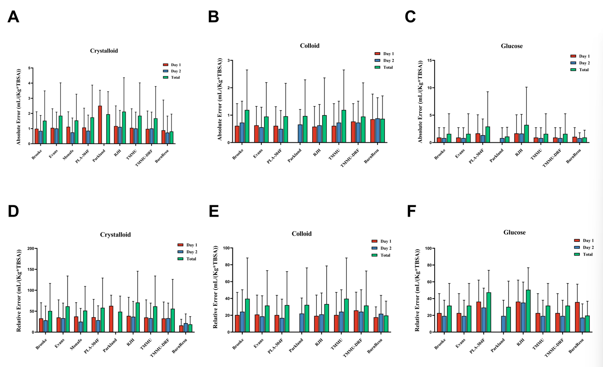
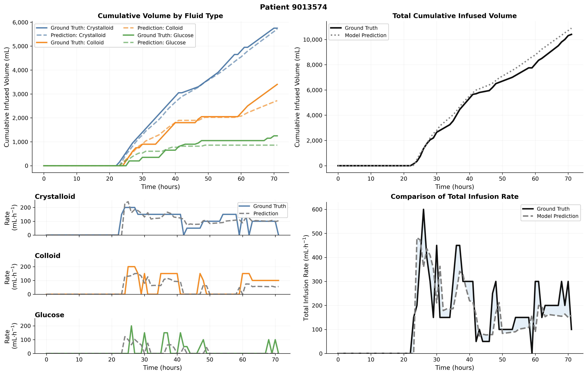

# BurnResu: A Multi-Task Temporal Prediction Framework for Early Burn Resuscitation

> **Xinyu Liu, Jingyuan Lang, Xiaoguang Lin, Haisheng Li, Ranran Sun, Xueliang Zhao, Qihan Wu, Zhiqiang Yuan, Ning Li, Gaoxing Luo**
>
> *Institute of Burn Research, Southwest Hospital, Third Military Medical University (Army Medical University)*
> *Chongqing Institute of Green and Intelligent Technology, Chinese Academy of Sciences*

Official implementation of BurnResu, a hierarchical temporal deep learning framework that jointly predicts fluid type and infusion rate for the first 72 hours after burn injury. The model integrates baseline characteristics, hourly vital signs, and fluid-administration histories in a rolling prediction paradigm.



## Overview

Burn shock is a leading cause of early mortality in patients with severe burns. Fluid resuscitation requires balancing the competing risks of hypoperfusion and fluid overload. Although empirical formulas (Parkland, Brooke, etc.) are widely used, they provide population-level estimates and fail to adapt to evolving patient hemodynamics.

BurnResu addresses this by:

- **Joint prediction** of fluid type (crystalloid / colloid / glucose) and infusion rate from multimodal temporal data
- **Multi-scale temporal encoding** capturing both rapid hemodynamic responses and gradual volume shifts
- **Patient-specific conditioning** via Feature-wise Linear Modulation (FiLM) of temporal representations on baseline features
- **Decision-first training objective** coupling instantaneous accuracy with cumulative dose fidelity

## Key Results

On a retrospective cohort of **364 patients** with severe burns (TBSA > 30%):

| Metric | Value |
|--------|-------|
| Classification AUC | **0.816** |
| Classification F1 | **0.743** |
| Regression MAE | **27.44 mL/h** |
| Regression R² | **0.820** |
| Regression RMSE | **60.04 mL/h** |

## Figures

### Framework Overview





### Comparative Performance



### Clinical Effectiveness





## Comparative Performance

| Model | Acc | Recall | F1 | AUC | MAE | R² | RMSE |
|-------|-----|--------|-----|-----|-----|-----|------|
| **Machine Learning Models** |
| Logistic Regression | 0.723 | 0.743 | 0.670 | 0.763 | 73.03 | 0.233 | 124.0 |
| Random Forest | 0.665 | 0.918 | 0.686 | 0.653 | 72.45 | 0.274 | 111.4 |
| SVM | 0.724 | 0.743 | 0.671 | 0.763 | 73.03 | 0.233 | 124.1 |
| XG-Boost | 0.694 | 0.890 | 0.699 | 0.645 | 71.45 | 0.326 | 107.6 |
| GBR | 0.727 | 0.761 | 0.672 | 0.763 | 30.62 | 0.759 | 69.42 |
| **Open-Loop CDSS** |
| Salinas et al. | — | — | — | — | 76.8 | 0.18 | 129.7 |
| **Deep Learning Models** |
| LSTM | 0.736 | 0.768 | 0.687 | 0.798 | 73.86 | 0.286 | 119.6 |
| CNN | 0.747 | 0.781 | 0.688 | 0.803 | 27.78 | 0.810 | 61.59 |
| Transformer | 0.744 | 0.747 | 0.690 | 0.804 | 30.90 | 0.795 | 63.98 |
| **BurnResu (Ours)** |
| BurnResu w/o Temporal Enc. | 0.499 | 0.921 | 0.652 | 0.735 | 74.32 | 0.272 | 120.8 |
| BurnResu w/o Baseline Enc. | 0.633 | 0.908 | 0.629 | 0.703 | 72.42 | 0.392 | 110.5 |
| **BurnResu (Full)** | **0.742** | **0.813** | **0.743** | **0.816** | **27.44** | **0.820** | **60.04** |

## Per-Class Performance

| Fluid Type | Precision | Recall | F1 | AUC |
|------------|-----------|--------|-----|-----|
| Crystalloid | 0.685 | 0.836 | 0.752 | 0.794 |
| Colloid | 0.668 | 0.798 | 0.727 | 0.834 |
| Glucose | 0.492 | 0.801 | 0.609 | 0.820 |
| **Macro Average** | **0.615** | **0.812** | **0.696** | **0.816** |

## Ablation Study

| Variant | AUC | F1 | MAE | RMSE |
|---------|-----|-----|-----|------|
| BurnResu w/o Temporal Encoder | 0.703 | 0.629 | 72.42 | 110.5 |
| BurnResu w/o Baseline Encoder | 0.735 | 0.652 | 74.32 | 120.8 |
| BurnResu w/o Self-Attention | 0.814 | 0.633 | 74.67 | 112.7 |
| BurnResu w/o TCN | 0.810 | 0.693 | 27.63 | 60.59 |
| BurnResu w/o FiLM | 0.806 | 0.683 | 28.88 | 64.12 |
| **BurnResu (Full)** | **0.816** | **0.743** | **27.44** | **60.04** |

**Key finding:** Removing the temporal encoder causes the largest degradation, confirming that sequential physiological dynamics are the dominant information source. Excluding baseline features, self-attention, TCN, or FiLM each reduces performance meaningfully.

## Clinical Formula Comparison

### Common Burn Resuscitation Formulas

| Formula | Crystalloid (24h) | Colloid (24h) | Glucose (24h) | Crystalloid (48h) | Colloid (48h) | Glucose (48h) |
|---------|-------------------|---------------|---------------|--------------------|----------------|----------------|
| Evans | 1.0 | 1.0 | 2000 | 0.5 | 0.5 | 2000 |
| Brooke | 1.5 | 0.5 | 2000 | 0.75 | 0.25 | 2000 |
| Parkland | 4.0 | — | — | — | — | * |
| Monafo | 2.0 | — | — | 1.0 | — | — |
| TMMU | 1.0 | 0.5 | 2000 | 0.5 | 0.25 | 2000 |
| RJH | 0.75 | 0.75 | 3000-4000 | 0.375 | 0.375 | 3000-4000 |
| PLA-304F | 0.9-1.0 | 0.9-1.0 | 3000-4000 | 0.7-0.75 | 0.7-0.75 | 3000 |
| TMMU-DRF | 1.3 | 1.3 | 2000 | 0.5 | 0.25 | 2000 |

> Units: mL·kg⁻¹·%TBSA⁻¹ for crystalloid/colloid; mL for glucose. * Parkland adjusts to maintain urine output at 30-50 mL/h.

## Model Architecture

BurnResu consists of three stages: a **Baseline Encoder**, a **Multi-Scale Temporal Encoder**, and a **Conditioned Decoder**.

```
  Baseline (b)                     Temporal (X)
  (demographics,                       │
   TBSA, injury)              ┌────────┴────────┐
       │                      │  Dilated TCN    │
       │                      │  (k=3, dil=1,2, │
       │                      │   4,8; 4 blocks) │
       │                      └────────┬────────┘
       │                               │
       ├────────── FiLM ───────────────┤
       │                               │
       │                      ┌────────┴────────┐
       │                      │  Causal         │
       └────── FiLM ──────────│  Transformer    │
                              │  (2 layers, 4   │
                              │   heads, d=128) │
                              └────────┬────────┘
                                       │
                              ┌────────┴────────┐
                              │  Conditioned    │
                              │  Representation │
                              └────────┬────────┘
                                       │
                       ┌───────────────┼───────────────┐
                       │               │               │
                   cls_head       reg_head        cum_head
                   (Tversky)      (ZILN +        (Cumulative
                                   Huber)         consistency)
```

### FiLM Conditioning

Temporal representations are modulated by patient-specific baseline embeddings:

$$\\tilde{\\mathbf{h}}_t = (1 + \\tanh(\\boldsymbol{\\gamma})) \\odot \\mathbf{h}_t + \\boldsymbol{\\beta}$$

where $\\boldsymbol{\\gamma}, \\boldsymbol{\\beta}$ are learned affine transformations of the baseline embedding. This allows the same temporal pattern to produce different infusion responses depending on patient-specific clinical context.

### Loss Function

The training objective integrates classification, regression, and temporal regularization:

$$\\mathcal{L} = \\lambda_{\\mathrm{cls}} \\mathcal{L}_{\\mathrm{cls}} + \\mathcal{L}_{\\mathrm{reg}} + \\mathcal{L}_{\\mathrm{tem}}$$

- **$\mathcal{L}_{\mathrm{cls}}$**: Tversky loss balancing precision and recall under class imbalance
- **$\mathcal{L}_{\mathrm{reg}} = \lambda_{\mathrm{cum}} \mathcal{L}_{\mathrm{cum}} + \lambda_{\mathrm{pos}} \mathcal{L}_{\mathrm{pos}}$**: Cumulative volume fidelity + log-transformed Huber on positive-flow points
- **$\mathcal{L}_{\mathrm{tem}}$**: Change-point penalties, total-variation smoothing, and early-prediction preconditioning

Loss weights: $\lambda_{\mathrm{cls}}=1.0$, $\lambda_{\mathrm{cum}}=0.5$, $\lambda_{\mathrm{pos}}=1.0$, $\lambda_{\mathrm{cp}}=0.1$, $\lambda_{\mathrm{tv}}=0.05$, $\lambda_{\mathrm{pre}}=0.05$.

## Repository Structure

```
├── main.py                 # Entry point: argument parsing, model building, train/eval dispatch
├── train.py                # Training loop with early stopping, checkpointing, scheduler
├── run_epoch.py            # Core epoch logic: forward pass, metrics, threshold tuning
├── inference.py            # Per-patient inference & 2×2 visualization export
├── val.py                  # External validation: AE/RE vs clinical formulas
├── generate_eval_plots.py  # Calibration plots, error analysis, Pareto curves, heatmaps
├── models/
│   ├── tcn_film.py         # BurnResu backbone + all ablation variants
│   ├── model.py            # FiLM, MLP, ZILN head components
│   ├── Flim.py             # Standalone FiLM baseline
│   ├── transformer.py      # Transformer baseline (causal mask, FiLM optional)
│   ├── Lstm.py             # BiLSTM baseline
│   ├── cnn.py              # 1D-CNN baseline
│   ├── mlp.py              # Simple MLP baseline
│   ├── Baseline.py         # Lightweight linear + FiLM baselines
│   ├── traditional_ml_models.py  # LR+GBR, Ridge, SVR wrappers
│   ├── TemporalEncoder.py  # Positional encoding, multi-head self-attention blocks
│   ├── Decoder_decision.py # Feed-forward, self-attention, speed predictor heads
│   └── BaseEncoder.py      # Baseline feature encoder
├── utils/
│   ├── data_loader.py      # Patient-stratified split, volume-conserving resampling
│   ├── util.py             # Metrics: F-beta thresholding, SMAPE, tolerance accuracy, NDTW
│   ├── Focal_loss.py       # Per-class Focal/Tversky Loss implementation
│   ├── post_process.py     # Output processing utilities
│   ├── InputClassifier.py  # Input-level classification head
│   └── ts_augmentation_toolkit.py  # Time-series data augmentation
├── data/
│   ├── data_fluid.py       # Fluid resuscitation data ingestion
│   ├── data2pkl.py         # Data to PKL serialization
│   ├── baseline2pkl.py     # Baseline feature extraction
│   ├── type_infusion.py    # Infusion type mapping & parsing
│   └── InsertionAndNornalization.py  # Data normalization pipeline
├── scripts/
│   ├── run.sh              # Batch training across models
│   ├── run_ablations.sh    # Ablation study runner
│   ├── run_ml.sh           # Traditional ML experiment runner
│   ├── roc.sh              # ROC curve generation
│   ├── Openloop_cdss.py    # Open-loop CDSS simulation (Salinas et al.)
│   └── EffectivenessValidation.py  # Clinical effectiveness vs formulas
├── figs/                   # Paper figures (framework, ROC, error comparison, trajectories)
├── Fig/                    # Individual model ROC plots & error bar charts
├── android/                # Android deployment (ONNX export + preprocessing)
├── draw/                   # ROC drawing utilities
├── ckpts/                  # Model checkpoints & evaluation metrics
└── results_plus/           # Clinical effectiveness summary tables
```

## Installation

```bash
git clone https://github.com/Aveouter/BurnResu.git
cd BurnResu

pip install torch numpy pandas scikit-learn matplotlib tqdm

# Optional: ONNX export for mobile deployment
pip install onnx onnxruntime
```

## Quick Start

### Training

```bash
# Train the full BurnResu model
python main.py --model ours --mode train --device cuda:0

# Train baselines
python main.py --model transformer --mode train --device cuda:0
python main.py --model lstm --mode train --device cuda:0
python main.py --model cnn --mode train --device cuda:0

# Train traditional ML models
python main.py --model ml_lr_gbr --mode train
python main.py --model ml_ridge  --mode train
python main.py --model ml_svr    --mode train
```

### Ablation Study

```bash
bash scripts/run_ablations.sh

# Individual ablations:
python main.py --model ours_wo_temporal  --mode train   # No temporal encoder
python main.py --model ours_wo_baseline  --mode train   # No baseline encoder
python main.py --model ours_wo_selfattn  --mode train   # No self-attention
python main.py --model ours_wo_tcn       --mode train   # No TCN
python main.py --model ours_wo_film      --mode train   # No FiLM conditioning
```

### Evaluation

```bash
# Evaluate on test set
python main.py --model ours --mode eval --device cuda:0

# Per-patient inference with visualization
python inference.py \
    --pkl_ts_path data/output_data_final.pkl \
    --pkl_base_path data/baseline.pkl \
    --model tcn_film --device cuda:0
```

### Clinical Effectiveness Validation

```bash
python val.py                                    # AE/RE vs formulas
python scripts/EffectivenessValidation.py        # Full effectiveness comparison
python generate_eval_plots.py --csv results_plus/effectiveness_summary_mean_std.csv
```

## Data Format

The pipeline expects two PKL files:

- **`data/output_data_final.pkl`** — Time-series dict: `{patient_id: {"data": DataFrame, "label": DataFrame}}`
  - `data`: 19-dim temporal features (vital signs, lab values)
  - `label`: `[bit_crystalloid, bit_colloid, bit_glucose, speed_crystalloid, speed_colloid, speed_glucose]`
- **`data/baseline.pkl`** — Static baseline dict: `{patient_id: DataFrame}` (10-dim: TBSA, age, weight, etc.)

Data is split at the patient level (70/15/15 train/val/test) to prevent leakage.

## Dataset Demographics

| Variable | Statistics | Missing Rate | Effect |
|----------|-----------|--------------|--------|
| Age [years] | 45 (28, 6) | — | 0.275 |
| BMI [kg/m²] | 22.9 (20.2, 25.3) | — | 0.380 |
| Male [%] | 271 (74.66%) | — | -0.107 |
| TBSA [%] | 45 (36, 62.5) | — | 0.491 |
| BSA 3rd degree | 2 (0, 31) | — | 0.591 |
| Inhalation Injury | 53 (14.6%) | — | 0.067 |
| Heart Rate [bpm] | 103 (89, 120) | 0.56% | -0.06 |
| Crystalloid Rate [mL/h] | 100 (100, 500) | — | — |
| Colloid Volume [mL] | 110 (100, 200) | — | — |
| Total Input [mL/h] | 230 (100, 500) | — | — |

> Data are median (IQR). Effect: standardized association with total infused fluid volume. From 364 patients, 451 screened; single-center retrospective study (2016-2023).

## Key Hyperparameters

| Parameter | Default | Description |
|-----------|---------|-------------|
| `--model` | `ours` | Model: `ours`, `transformer`, `lstm`, `cnn`, `mlp`, `flim`, `base`, or ablations |
| `--embed_dim` | 128 | Latent dimension |
| `--history_length` | 1 | Historical window length |
| `--pred_length` | 1 | Prediction horizon |
| `--batch_size` | 4 | Training batch size |
| `--epochs` | 500 | Maximum training epochs |
| `--learning_rate` | 1e-3 | Initial learning rate (Adam) |
| `--lr_scheduler` | `step` | LR schedule: `step`, `cosine`, `plateau` |
| `--lr_step` | 100 | StepLR step size |
| `--lr_gamma` | 0.1 | StepLR decay factor |
| `--use_focal` | True | Use Focal/Tversky Loss |
| `--use_robust_reg` | True | Use Huber regression loss |
| `--lambda_cls` | 1.0 | Classification loss weight |
| `--lambda_reg` | 0.5 | Regression loss weight |
| `--lambda_consistency` | 0.1 | Cumulative consistency weight |
| `--main_metric` | `f1` | Checkpoint selection metric |
| `--seed` | 42 | Random seed |

## Android Deployment

```bash
cd android
python export_onnx.py   # Export trained model to ONNX
python preprocess.py     # Preprocessing pipeline for mobile input
python run.py            # Run inference on Android
```

## Citation

```bibtex
@article{liu2025burnresu,
  title={BurnResu: A Multi-Task Temporal Prediction Framework for Early Burn Resuscitation},
  author={Liu, Xinyu and Lang, Jingyuan and Lin, Xiaoguang and Li, Haisheng and
          Sun, Ranran and Zhao, Xueliang and Wu, Qihan and Yuan, Zhiqiang and
          Li, Ning and Luo, Gaoxing},
  journal={TBD},
  year={2025}
}
```

## License

This project is for research purposes. The data used in this study are not publicly available due to institutional and ethical restrictions but may be made available upon reasonable request to the corresponding author, subject to institutional review board approval.

## Contact

- **Xiaoguang Lin** — Chongqing Institute of Green and Intelligent Technology, CAS
- **Haisheng Li** — Southwest Hospital, Third Military Medical University
- **Gaoxing Luo** — Institute of Burn Research, Southwest Hospital

Source code: [https://github.com/Aveouter/BurnResu](https://github.com/Aveouter/BurnResu)
