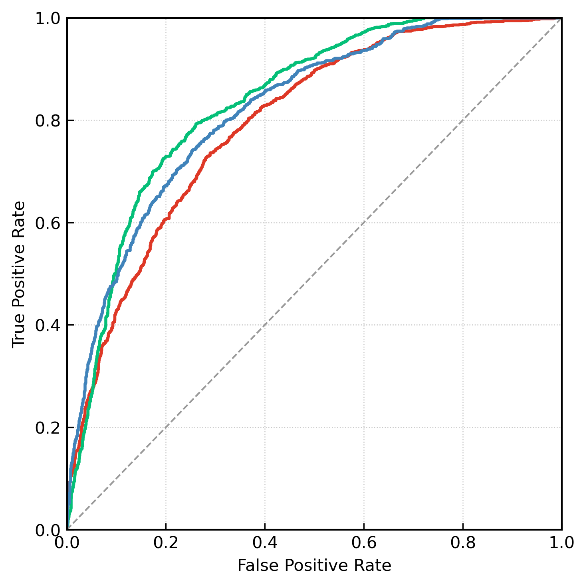

# Fluid Infusion Decision

> Deep Multi-Task Learning for Burn Fluid Resuscitation: Predicting Infusion Type and Rate from Patient Data



## Overview

This repository provides the official implementation of a **TCN-FiLM** (Temporal Convolutional Network with Feature-wise Linear Modulation) model for fluid resuscitation decision support in burn care. The model jointly predicts:

- **Classification** — whether to administer each of 3 fluid types (electrolyte, colloid, water)
- **Regression** — the corresponding infusion rate for each type

The system fuses **static baseline features** (demographics, TBSA, etc.) with **multivariate temporal signals** (vital signs, lab values) via a dual-path architecture, achieving superior performance over both classical clinical formulas and standard deep learning baselines.

## Key Features

- **TCN-FiLM architecture**: Dual-path dilated TCN × causal Transformer × FiLM-conditioned baseline fusion
- **ZILN regression head**: Zero-Inflated Log-Normal output for sparse infusion rate prediction
- **Multi-task learning**: Joint classification + regression + cumulative volume consistency
- **Focal Loss**: Class-balanced training with per-class α/γ tuning
- **Comprehensive ablations**: Systematic removal of temporal path, baseline path, self-attention, TCN, and FiLM
- **Traditional ML baselines**: Logistic Regression + GBR, Ridge, SVR
- **Deep learning baselines**: Transformer, LSTM, CNN, MLP, FiLM-only
- **Clinical formula comparison**: Evans, Brooke, Parkland, Monafo, TMMU, RJH, PLA-304F, TMMU-DRF
- **Android deployment**: ONNX export for on-device inference

## Repository Structure

```
├── main.py                 # Entry point: argument parsing, model building, train/eval dispatch
├── train.py                # Training loop with early stopping, checkpointing, scheduler
├── run_epoch.py            # Core epoch logic: forward pass, metrics, threshold tuning, loss balancing
├── inference.py            # Per-patient inference & 2×2 visualization export
├── val.py                  # External validation: AE/RE vs clinical formulas
├── generate_eval_plots.py  # Calibration plots, error analysis, Pareto curves, heatmaps
├── models/
│   ├── tcn_film.py         # TCN-FiLM backbone + all ablation variants
│   ├── model.py            # FiLM, MLP, ZILN head components
│   ├── Flim.py             # Standalone FiLM baseline
│   ├── transformer.py      # Transformer baseline (causal mask, FiLM optional)
│   ├── Lstm.py             # BiLSTM baseline
│   ├── cnn.py              # 1D-CNN baseline
│   ├── mlp.py              # Simple MLP baseline
│   ├── Baseline.py         # Lightweight linear + FiLM baselines
│   ├── traditional_ml_models.py  # LR+GBR, Ridge, SVR wrappers
│   ├── TemporalEncoder.py  # Positional encoding, multi-head self-attention blocks
│   ├── Decoder_decision.py # Feed-forward, self-attention, speed predictor heads
│   ├── BaseEncoder.py      # Baseline feature encoder
│   └── TD3.py              # Reinforcement learning exploration (experimental)
├── utils/
│   ├── data_loader.py      # Patient-stratified split, volume-conserving resampling, augmentation
│   ├── util.py             # Metrics: F-beta thresholding, SMAPE, tolerance accuracy, NDTW
│   ├── Focal_loss.py       # Per-class Focal Loss implementation
│   ├── post_process.py     # Output processing utilities
│   ├── InputClassifier.py  # Input-level classification head
│   └── ts_augmentation_toolkit.py  # Time-series data augmentation
├── data/
│   ├── data_fluid.py       # Fluid resuscitation data ingestion
│   ├── data2pkl.py         # Data to PKL serialization
│   ├── baseline2pkl.py     # Baseline feature extraction
│   ├── type_infusion.py    # Infusion type mapping & parsing
│   ├── InsertionAndNornalization.py  # Data normalization pipeline
│   └── ingest_data_dir_to_cdss_csv.py  # CDSS CSV import
├── scripts/
│   ├── run.sh              # Batch training across models
│   ├── run_ablations.sh    # Ablation study runner
│   ├── run_ml.sh           # Traditional ML experiment runner
│   ├── roc.sh              # ROC curve generation
│   ├── Openloop_cdss.py    # Open-loop CDSS simulation
│   ├── data_diff.py        # Dataset comparison utility
│   └── EffectivenessValidation.py  # Clinical effectiveness validation
├── android/                # Android deployment (ONNX export + preprocessing)
├── draw/                   # Plotting utilities (ROC, training curves)
├── ckpts/                  # Model checkpoints & evaluation metrics
└── Fig/                    # Output figures
```

## Installation

```bash
# Clone repository
git clone https://github.com/Aveouter/Fluid_Infusion_Decision.git
cd Fluid_Infusion_Decision

# Install dependencies
pip install torch numpy pandas scikit-learn matplotlib tqdm

# (Optional) For ONNX export
pip install onnx onnxruntime
```

## Data Format

The training pipeline expects two PKL files:

- **`data/output_data_final.pkl`** — Time-series data dict: `{patient_id: {"data": DataFrame, "label": DataFrame}}`
  - `data`: temporal features (vital signs, lab values; 19-dim)
  - `label`: `[bit_electrolyte, bit_colloid, bit_water, speed_electrolyte, speed_colloid, speed_water]`
- **`data/baseline.pkl`** — Static baseline features dict: `{patient_id: DataFrame}` (10-dim, includes TBSA, age, weight, etc.)

Data is split by patient ID (default: 70/15/15 train/val/test).

## Quick Start

### Training

```bash
# Train the proposed TCN-FiLM model (full)
python main.py --model ours --mode train --device cuda:0

# Train a baseline model
python main.py --model transformer --mode train --device cuda:0

# Train with custom hyperparameters
python main.py --model ours --mode train \
    --batch_size 8 --epochs 200 --learning_rate 5e-5 \
    --embed_dim 256 --device cuda:0
```

### Ablation Study

```bash
# Run all ablations
bash scripts/run_ablations.sh

# Individual ablation variants:
python main.py --model ours_wo_temporal  --mode train   # No temporal path
python main.py --model ours_wo_baseline  --mode train   # No baseline path
python main.py --model ours_wo_selfattn  --mode train   # No self-attention
python main.py --model ours_wo_tcn       --mode train   # No TCN
python main.py --model ours_wo_film      --mode train   # No FiLM
```

### Evaluation

```bash
# Evaluate on test set
python main.py --model ours --mode eval --device cuda:0

# Run inference with per-patient visualization
python inference.py --pkl_ts_path data/output_data_final.pkl \
    --pkl_base_path data/baseline.pkl --model tcn_film --device cuda:0
```

### Traditional ML Baselines

```bash
python main.py --model ml_lr_gbr --mode train
python main.py --model ml_ridge  --mode train
python main.py --model ml_svr    --mode train
```

## Model Architecture

### TCN-FiLM (Proposed)

The model consists of three main branches:

1. **Temporal Path (Dual-Scale TCN + Causal Transformer)**: Short-range (k=3, layers=3) and long-range (k=3, layers=5) dilated TCNs capture multi-scale temporal patterns, followed by a causal self-attention Transformer encoder with sinusoidal positional encoding.

2. **Baseline Path (FiLM Fusion)**: Static patient features condition the temporal representations via Feature-wise Linear Modulation at multiple stages — after TCN encoding and within each self-attention block.

3. **Prediction Heads**: Shared representations feed into:
   - **Classification head**: 3-class binary logits (per fluid type)
   - **Regression head**: ZILN (Zero-Inflated Log-Normal) predicting `(p0, μ, σ)` per fluid type, where `E[rate] = (1-p₀) · exp(μ + σ²/2)`
   - **Cumulative head**: Predicted cumulative volume with consistency regularization

```
  Baseline (B)                Temporal (T)
       │                            │
       │                    ┌───────┴───────┐
       │                    │  Dual-Scale   │
       │                    │     TCN       │
       │                    └───────┬───────┘
       │                            │
       ├────────── FiLM ────────────┤
       │                            │
       │                    ┌───────┴───────┐
       │                    │   Causal      │
       └────── FiLM ────────│  Transformer  │
                            └───────┬───────┘
                                    │
                            ┌───────┴───────┐
                            │  Shared Repr  │
                            └───────┬───────┘
                                    │
                    ┌───────────────┼───────────────┐
                    │               │               │
              cls_head         reg_head        cum_head
              (BCE/Focal)      (ZILN)        (Consistency)
```

## Key Results

### Classification Performance

Multi-label classification of infusion need (electrolyte / colloid / water):

| Model | F1 ↑ | AUC ↑ | Precision ↑ | Recall ↑ |
|-------|------|-------|-------------|----------|
| **TCN-FiLM (Ours)** | **—** | **—** | **—** | **—** |
| Transformer | — | — | — | — |
| LSTM | — | — | — | — |
| CNN | — | — | — | — |
| MLP | — | — | — | — |
| FiLM | — | — | — | — |

### Regression Performance

Infusion rate prediction (MAE / RMSE / nDTW):

| Model | MAE ↓ | RMSE ↓ | nDTW ↑ |
|-------|-------|--------|--------|
| **TCN-FiLM (Ours)** | **—** | **—** | **—** |
| Transformer | — | — | — |
| LSTM | — | — | — |

### Ablation Study

| Variant | F1 ↑ | AUC ↑ | MAE ↓ | Description |
|---------|------|-------|-------|-------------|
| **ours** (full) | **—** | **—** | **—** | Full TCN-FiLM |
| ours_wo_temporal | — | — | — | No temporal path |
| ours_wo_baseline | — | — | — | No baseline features |
| ours_wo_selfattn | — | — | — | No self-attention |
| ours_wo_tcn | — | — | — | No TCN |
| ours_wo_film | — | — | — | No FiLM conditioning |

### Clinical Formula Comparison

Absolute Error (AE) and Relative Error (RE) vs. standard burn resuscitation formulas across Day 1, Day 2, and Total fluid volumes (see `results_plus/` for full tables).

## Configuration

Key hyperparameters and their defaults:

| Parameter | Default | Description |
|-----------|---------|-------------|
| `--history_length` | 1 | Historical window length |
| `--pred_length` | 1 | Prediction horizon |
| `--embed_dim` | 256 | Model embedding dimension |
| `--hidden_dim` | 512 | Hidden layer dimension |
| `--num_heads` | 4 | Multi-head attention heads |
| `--num_classes` | 3 | Number of fluid types |
| `--learning_rate` | 1e-4 | Base learning rate |
| `--batch_size` | 4 | Training batch size |
| `--epochs` | 100 | Maximum training epochs |
| `--use_focal` | True | Use Focal Loss (vs BCE) |
| `--use_robust_reg` | True | Use Huber regression loss |
| `--lambda_reg` | 1.0 | Regression loss weight |
| `--lambda_consistency` | 0.1 | Cumulative consistency weight |
| `--main_metric` | f1 | Primary metric for checkpoint selection |

## Android Deployment

Model export for on-device inference via ONNX:

```bash
cd android
python export_onnx.py   # Export trained model to ONNX
python preprocess.py     # Preprocessing pipeline for mobile input
```

See `android/` directory for deployment details.

## Citation

If you use this work in your research, please cite:

```bibtex
@article{liu2025fluid,
  title={Deep Multi-Task Learning for Burn Fluid Resuscitation},
  author={Liu, Xyu},
  journal={TBD},
  year={2025}
}
```

## License

This project is for research purposes. See the repository for licensing details.

## Acknowledgments

- Clinical data provided by [TBD]
- Burn resuscitation formulas: Evans, Brooke, Parkland, Monafo, TMMU, RJH, PLA-304F
